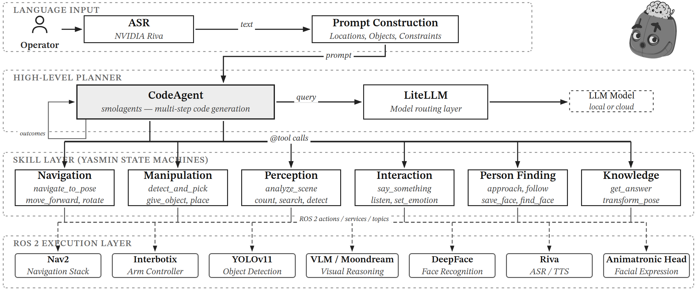

# BORISAgent

<p align="center">
  
</p>

<p align="center">
  <strong>A modular architecture for LLM-based task planning in domestic service robots</strong>
</p>

<p align="center">
  <a href="https://borisagent.netlify.app"></a>
</p>

<p align="center">
  <a href="https://boris-agent.netlify.app"></a>
  <a href="https://github.com/fbotathome"></a>
  <a href="#citation"></a>
</p>

---

## 📖 Abstract

We present a modular architecture for general-purpose domestic robots that confines non-deterministic reasoning to a large language model (LLM) acting as a **code-generating planner**, while delegating execution, monitoring, and recovery to a deterministic skill layer built on **ROS 2 state machines**.

This approach requires no fine-tuning or domain-specific training data, relying entirely on the reasoning capabilities of foundation models guided by structured prompting.

### Key Results

| Metric | Value |
|--------|-------|
| **Best Task Completion** | 95.0% |
| **Foundation Models Evaluated** | 8 |
| **Robot Skills Available** | 20 |
| **Benchmark Commands** | 100 |
| **CBR 2025 Competition Score** | 880/1000 |

---

## 🏗️ Architecture

The BORISAgent architecture consists of:

1. **ASR Module** — Transcribes natural-language commands from speech
2. **Prompt Construction** — Augments commands with environment context
3. **LLM Planner** — Decomposes tasks into `@tool` calls using code generation
4. **Skill Layer** — Executes YASMIN state machines interfacing with ROS 2
5. **Robot Platform** — BORIS: 1.48m robot with SHARK base, WidowX-200 arm, and NVIDIA Jetson Orin AGX

---

## 📊 Model Comparison

We evaluated 8 foundation models ranging from 3B to 70B parameters:

| Model | Type | Overall Score |
|-------|------|---------------|
| Claude Sonnet 4.6 | Cloud | **95%** |
| Gemini 3 Flash | Cloud | 89% |
| Qwen3 32B | Open-weight | 76% |
| Llama 3.3 70B | Open-weight | 65% |
| Qwen3 14B | Open-weight | 64% |
| Gemma 3 27B | Open-weight | 37% |
| Llama 3.1 8B | Open-weight | 26% |
| Llama 3.2 3B | Open-weight | 14% |

*Task Score = % of tasks scoring ≥2 on a 4-point scale (greedy decoding, same prompt across all models)*

---

## 🤖 The BORIS Robot

BORIS is a 1.48m domestic service robot featuring:

- **Mobile Base:** SHARK omnidirectional platform
- **Manipulation:** WidowX-200 robotic arm
- **Perception:** RGB-D cameras, LiDAR
- **Expression:** Animatronic head
- **Compute:** NVIDIA Jetson Orin AGX

---

## 📄 Citation

If you use BORISAgent in your research, please cite:

```bibtex
@inproceedings{dorneles2025borisagent,
  title     = {A BORISAgent Architecture for LLM-Based Task Planning
               in Domestic Service Robots},
  author    = {Dorneles, Gabriel A. and Assis, Richard J. C. and
               Froes, Cris L. and Guerra, Rodrigo S. and
               Drews-Jr, Paulo L.J.},
  booktitle = {RoboCup@Home / CBR 2025},
  year      = {2025},
  url       = {https://github.com/fbotathome}
}
```

---

## 👥 Authors

- **Gabriel A. Dorneles**
- **Richard J. C. Assis**
- **Cris L. Froes**
- **Rodrigo S. Guerra**
- **Paulo L. J. Drews-Jr**

<p align="center">
  <a href="http://www.c3.furg.br">Center for Computational Sciences (C3)</a> · 
  <a href="https://www.furg.br">Universidade Federal do Rio Grande (FURG)</a>, Brazil
</p>

---

## 📜 License

This project is part of academic research. Please contact the authors for licensing inquiries.
